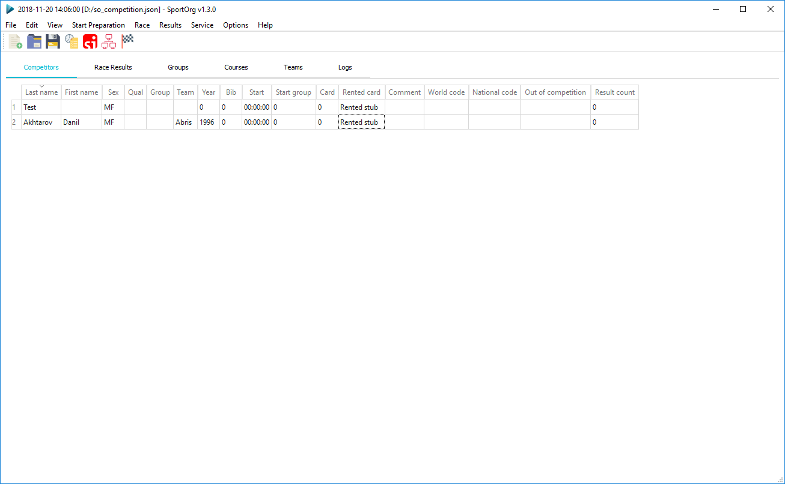
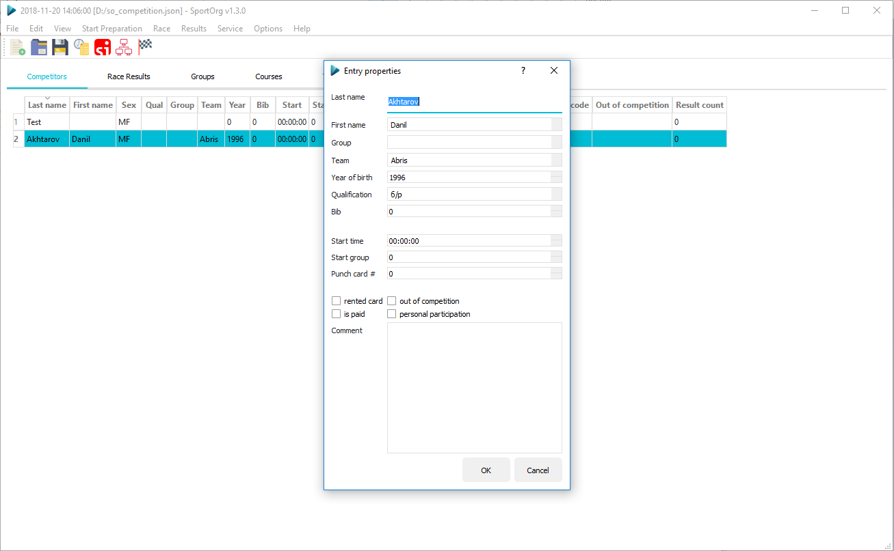
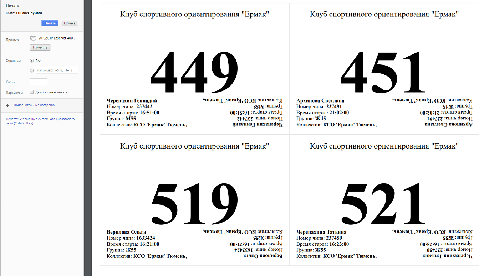

# SportOrg for MacOS

[](https://www.python.org/downloads/)
[](https://github.com/PAE16/SportOrg-for-MacOS)
[](LICENSE)
[](https://github.com/sportorg)

SportOrg is a desktop application for organizing and running orienteering competitions. It manages races, participants, groups, courses, teams, results, relay events, electronic timing and report generation.

This repository contains the MacOS-focused build of SportOrg. The packaged application is a universal binary and runs natively on Apple Silicon Macs (`arm64`) as well as Intel Macs (`x86_64`).

## MacOS support

- Apple Silicon: M1, M2, M3, M4 and newer (`arm64`)
- Intel Macs (`x86_64`)
- Universal `.app` bundle and compressed `.dmg` installer
- Native Qt interface through PySide6
- Application data, templates, sounds and logs are stored next to the application and do not depend on the current working directory

The application can work with a database shared over the local network. The MacOS build uses the same race data and teamwork features as the main SportOrg application.

## Install on MacOS

1. Download `SportOrg.dmg` from the project's build artifacts or release page.
2. Open the DMG image.
3. Drag `SportOrg.app` to the Applications folder.
4. Start SportOrg from Applications.

On the first launch, macOS may ask for confirmation because the application is distributed outside the Mac App Store.

## What changed in this version

- Added and verified a MacOS application bundle with a proper `.icns` icon.
- Added universal packaging for both Apple Silicon and Intel Macs.
- Added DMG generation through `cx_Freeze`.
- Added SFRX import and export support for event data, courses, participants, results and splits.
- Added a SportOrg-to-SFR mapping layer for groups, teams and participants.
- Added SFR results board (`SRB`) generation when saving.
- Added full date of birth and middle-name support.
- Added a collection of report templates, including HTML, DOCX and CSV templates.
- Improved resource resolution so templates, configurations, sounds and logs work correctly from the packaged application.
- Added safer handling of missing qualifications, teams, groups and time values during SFR export.

See [changelog.md](changelog.md) for the full English change history and [changelog_ru.md](changelog_ru.md) for the Russian version.

## Build the MacOS application

Install the locked dependencies with the GUI extra, then run:

```bash
uv sync --frozen --extra gui
uv run python builder.py bdist_dmg
```

The result is created in `build/`:

- `build/SportOrg.app` - MacOS application bundle
- `build/SportOrg.dmg` - compressed installer image

The generated application executable is checked as a universal Mach-O binary containing both `arm64` and `x86_64` architectures.

## Run from source

See [CONTRIBUTING.md](CONTRIBUTING.md) for the development setup and test commands.

```bash
uv sync --frozen --extra gui
uv run poe run
```

Run the focused SFR exporter tests with:

```bash
uv run pytest tests/test_sfrxexporter.py -q
```

## Screenshots






